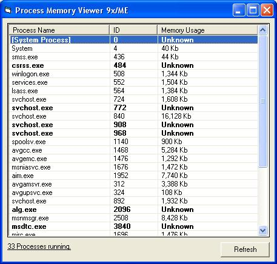



## View Each Process's Memory

### Description

Easily view the amount of memory a process is using. Works on all Windows OS's (well at least 9x, ME, 2k, NT, XP). Take a look. Please vote :). Let me know of any bugs/comments or features ud like to see :)
 
### More Info
 

             |
---                |---
**Submitted On**   |2005-01-10 21:53:38
**By**             |[Marcin Kleczynski](https://github.com/Planet-Source-Code/PSCIndex/blob/master/ByAuthor/marcin-kleczynski.md)
**Level**          |Advanced
**User Rating**    |4.0 (8 globes from 2 users)
**Compatibility**  |VB 6\.0
**Category**       |[Complete Applications](https://github.com/Planet-Source-Code/PSCIndex/blob/master/ByCategory/complete-applications__1-27.md)
**World**          |[Visual Basic](https://github.com/Planet-Source-Code/PSCIndex/blob/master/ByWorld/visual-basic.md)
**Archive File**   |[View\_Each\_1838951102005\.zip](https://github.com/Planet-Source-Code/marcin-kleczynski-view-each-process-s-memory__1-58230/archive/master.zip)

